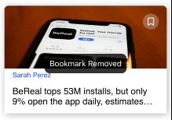
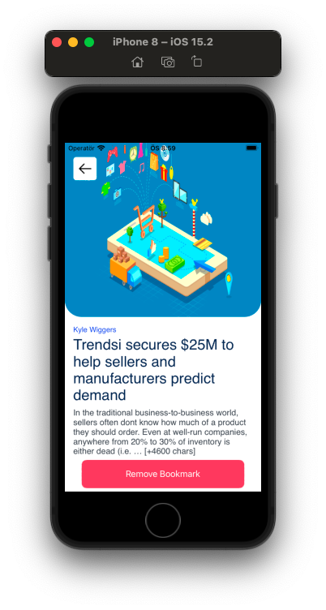

# Travel Guide App - Fmss - Patika - Graduate

It is an application that lists project articles, hotels and flights, and saves them as bookmarks. It can also be searched. These are drawn and displayed with the API.

This project is a graduation project given at the end of ```IOS Swift Bootcamp 7 Week``` training done by [patika.dev](https://www.patika.dev) - [FMSS](https://fmss.com.tr/en)

### APP Movie

<a href="https://www.youtube.com/watch?v=M23T3KFRa8o&t=34s">
    
</a>


### Tools 
- MVVM
- Delegation Pattern
- NotificationCenter
- Closures
- Swift-Storyboard
- UI
  - CollectionView
  - TableView
  - ScrollView
  - TabBar
  - Navigation
- Fonts
  - Source Sans Pro
  - Montserrat
### Packages
- Swift Package Manager
  - [Alamofire](https://github.com/Alamofire/Alamofire.git)
  - [Kingfisher](https://github.com/onevcat/Kingfisher.git)
  - [Toast-Swift](https://github.com/scalessec/Toast-Swift.git)
   
### App Icon


### App Launch Screen


### Home
<p align='center'>
    
      
</p>

### Flights & Hotels & Bookmarks List Page
<p align='center'>
    
      
          
</p>

### Detail Page
<p align='center'>
    
      
</p>

### Detail Page Bookmark Add/Remove Buttons & Toast Messages
<p align='center'>
    
      
</p>
<p align='center'>
    
      
</p>

### Article Bookmark Add/Remove Buttons & Toast Messages
<p align='center'>
    
      
         
</p>

### Search Hotel
<p align='center'>
    
      
         
</p>

### Search Flight
<p align='center'>
    
     
</p>


### Responsive Iphone 8

<p align='center'>
    
    
    
    
    
    
    
    
    
</p>